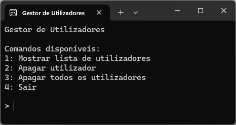
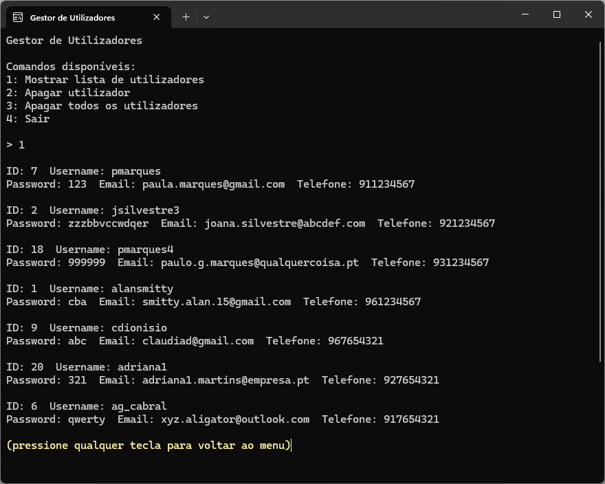
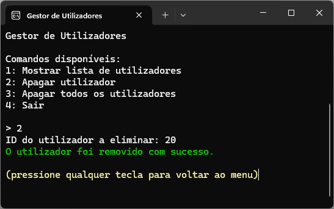
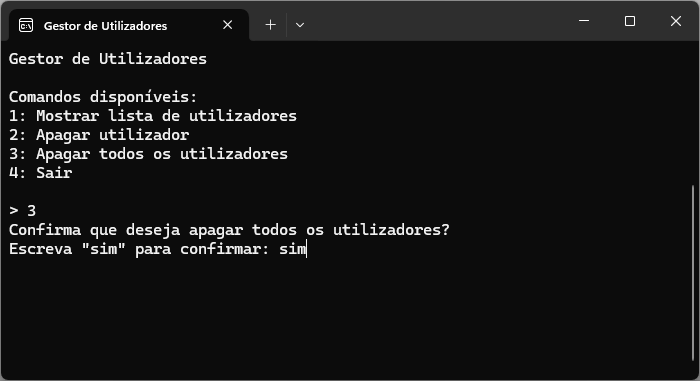

# Ficha de Trabalho: Gestor de Utilizadores

Nesta ficha de trabalho irá utilizar o projeto Visual Studio disponibilizado neste repositório, de modo a completar um programa para armazenar e manipular dados de utilizadores. Para efeito deverá utilizar uma estrutura do tipo ```Dictionary<>```.

Para cada utilizador é necessário armazenar a seguinte informação:

- o username
- a password
- o email
- o número de telefone



## Resolução

Crie uma ```struct``` para armazenar os dados dos utilizadores.
Declare uma estrutura do tipo ```Dictionary<>``` para armazenar dados de vários utilizadores.
A chave do ```Dictionary<>``` deverá ser um número inteiro, ao qual vamos chamar ```ID```: o ```ID``` identifica inequivocamente cada utilizador.

## Dados a inserir

O dicionário deve ser inicializado com os seguintes dados (nesta ordem):

|Chave (ID)|Username|Password|Email|Telefone|
|---|---|---|---|---|
|7|pmarques|123|paula.marques@gmail.com|911234567|
|2|jsilvestre3|zzzbbvccwdqer|joana.silvestre@abcdef.com|921234567|
|18|pmarques4|999999|paulo.g.marques@qualquercoisa.pt|931234567|
|1|alansmitty|cba|smitty.alan.15@gmail.com|961234567|
|9|cdionisio|abc|claudiad@gmail.com|967654321|
|20|adriana1|321|adriana1.martins@empresa.pt|927654321|
|6|ag_cabral|qwerty|xyz.aligator@outlook.com|917654321|

## Etapas necessárias para a resolução

1. Criar a ```struct Utilizador``` com os respetivos campos
2. A ```struct Utilizador``` deverá ter um construtor que inicializa os campos
3. Criar o dicionário que armazena os utilizadores
4. Inserir dados dos utilizadores no dicionário
5. Completar o código para implementar as seguintes operações:
    - Mostrar todos os utilizadores armazenados no dicionário
    - Apagar um utilizador específico
    - Apagar todos os utilizadores






